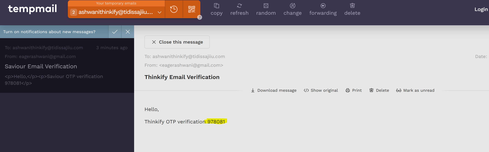

# Event Registration 
It's a simple event registration app with CRUD operations, along with authentication and authorization.

## Initial setup
- Create a DB name `eventthinkify`
- For Verification of user email
   ```
    spring.mail.username=your-gmail-id
    spring.mail.password=your-gmail-password
  ```
- In `EmailSenderService.java`, At below line 👇, Use your gmail that provided in `application.properties`
  ```
   message.setFrom("eagerashwani@gmail.com");
  ```

## How to start in your system
After doing the initial setup, Roll up the sleeves 👇
- Clone the repo
- Open in your favourite IDE
- Reload the project (To get all dependencies)

## Dependencies of project
- Spring Starter Web
- Spring Data JPA
- Lombok
- PostgresQL Driver
- Jackson JWT
- Spring Security
- Spring Mail
- ModelMapper

## Flow of the system
- First, You have to create the user.
  - We have 2 methods for signup
    - Normal Signup (email and password)
    - Google Sign up
- Than User have to verifies there email. ie: If user `email is not verified` than user is `not able to login` (**access the system**)
- To verify the user email, An email with OTP was send to user registered mail.
- After verifying the email, Just login with email and password and got the `token`
- User is able to access Event Api based on their role

## APIs
- `Post` Method, Url: `localhost:8081/api/signup`, Body 👇
  ```
  {
    "email": "ashwanithinkify@tidissajiiu.com",
    "password": "password@123",
    "roles":[
        "ATTENDEE",
        "ORGANIZER"
    ]
  }
  ```
  

- Check the mail id
  
  

- When tried to login without verify the email
  
  

- `Post` Method, Url: `localhost:8081/verify/otp`, Body 👇
  ```
  {
    "email": "ashwanithinkify@tidissajiiu.com",
    "otp": 978081
  }
  ```
    - If OTP expires, expires in 5 min

        

- `Post` Method, Url: `localhost:8081/api/login`, Body 👇
  ```
  {
    "email": "ashwanithinkify@tidissajiiu.com",
    "password": "password@123"
  }
  ```
  

- Check the token data
  

### Event APIs

- `Post` Method, Url: `localhost:8081/event/create-event`, Body 👇 with `token`
  ```
  {
    "name": "Thinkify Labs Conference",
    "description": "A conference about Spring Boot",
    "location": "New York",
    "startDate": "2024-06-15T09:00:00.000Z",
    "endDate": "2024-06-15T17:00:00.000Z",
    "organizerId": 3
  }
  ```
  

- `Get` Method, Url: `localhost:8081/event/get-all-events`, Get All Event Data
  

- `Get` Method, Url: `localhost:8081/event/get-one-event/1`, Get Single Event Data
  

- `Put` Method, Url: `localhost:8081/event/update-event/1`, Body 👇
  ```
  {
    "name": "Thinkify Delhi conference",
    "description": "A conference about Spring Boot",
    "location": "New Delhi",
    "startDate": "2024-06-15T09:00:00.000Z",
    "endDate": "2024-06-15T17:00:00.000Z",
    "organizerId": 3
  }
  ```
  If token is correct
  

  If token is incorrect or tempered
  

- `Delete` Method, Url: `localhost:8081/event/delete-event/3`
  

  After Deleting, Hit Again All Event api
  

## Database Images
- Event Table
  

- User roles
  

- User Table
  

- Verification Table
  

## Improvement to be done
- Use Constructor Injection insteaad of Autowired whereever possible.
- All Exceptions are handled, but not in a proper way
- Response should be in predefined way
- Validation of DTOs
- Token Management
- Use Lookup Table instead of Role Enum
- Testing 